# 浏览器输入网址后发生了什么？
从输入网址到显示数据，在这几秒的过程中，是很多硬件和软件在各自的岗位上相互配合完成了一系列的工作。为了解答“ 浏览器输入网址后发生了什么？”，本文将介绍这一系列工作中的每一个环节。但如果对每个环节都进行详细的介绍，会让这篇文章太过冗长。我们会将每个环节抽象成一个个简单的模型，这样有助于我们对每个工作过程有一个整体的把握。

在对每个环节进行详细介绍之前，我们先对整个过程做一个简单的介绍，帮助大家不会因为看不到整体而迷失方向。我们将整个工作过程分为六块，其中包含客户端、客户端局域网、接入网、互联网、Web服务器器端局域网和服务端。在浏览器输入完网址后，以Web浏览器为起点，经过各种网络设备，最后到达终点Web服务器。

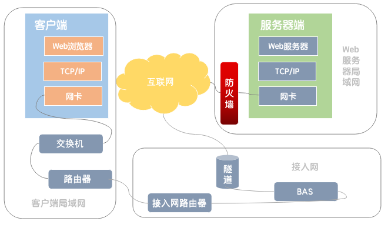

# 客户端

用户在浏览器输入网址后，浏览器接下来的工作会从对用户输入的网址进行解析，会根据网址的含义生成请求消息。请求消息生成以后，浏览器需要向DNS服务器查询域名对应的IP地址。查询到IP地址以后，浏览器将消息委托给操作系统发送给Web服务器。操作系统接收到委托后，协议栈通过TCP协议收发数据。IP协议控制网络包收发操作，与网卡进行配合，将数据封装成网络包，在将网络包转化成电信号或光信号发送出去。

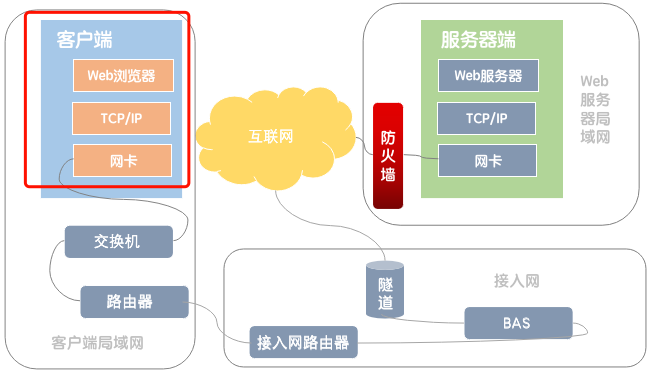

## Web浏览器

### 1、生成HTTP请求消息

输入网址后，浏览器会按照一定的规则去解析网址的含义，然后按照其含义生成请求消息。在探讨浏览器是怎么解析URL之前，我们首先要了解URL。URL(统一资源定位符)是因特网上标准的资源的地址，标准格式如下：

>{协议类型}://{服务器地址}:{端口号}/{资源层级UNIX文件路径}{文件名}?{查询}#{片段ID}

对 URL 进行解析之后，浏览器确定了 Web 服务器和文件名，接下来就是根据这些信息来生成 HTTP 请求消息。具体的HTTP请求消息的格式为：

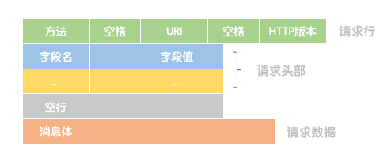

### 2、向DNS服务器查询Web服务器的IP地址

因为浏览器本身并不具备将消息发送到网络的功能，所以需要委托操作系统来实现。在这一操作之前，我们还有一个工作需要完成，那就是DNS服务器查询网址中服务器域名对应的IP地址。

在了解如何向DNS服务器查询Web服务器的IP地址之前，先介绍一下IP地址的基本知识。

IP地址是一串32比特的数字，按照8比特为一组分成4组，分别用十进制表示，用圆点隔开。在IP地址的规则中，这32比特的数字构成了IP地址的网络号和主机号。IP地址的网络号和主机号是根据子网掩码划分的。子网掩码的长度也是32位，左边是网络位，用二进制数字“1”表示；右边是主机位，用二进制数字“0”表示。

“192.168.1.1”和子网掩码为“255.255.255.0”的二进制对照。其中，“1”有24个，代表与此相对应的IP地址左边24位是网络号；“0”有8个，代表与此相对应的IP地址右边8位是主机号。

DNS服务器中所有的信息都是按照域名以分层次的结构来保存的。DNS中的域名都是用句点来分隔的，域名中越靠右的位置表示层级越高。一个域的信息是作为一个整体存放在DNS服务器中的，不能将一个域拆来来存放在多台DNS服务器中。比如www.baidu.com，com域的下一层域是baidu域，在下一层域是www。但com域(成为顶级域)并不是最顶层的域，在com域上面还有一级域，成为根域。

互联网中有数万台DNS服务器，肯定不能一台一台的进行查找，我们可以采用下面的方法。首先将负责管理下级域的DNS服务器的IP地址注册到它们的上级DNS服务器中，然后上级DNS服务器的IP地址在注册到更上一级的DNS服务器，以此类推，直到将顶级域的IP地址注册到根域。这样我们就可以通过上级DNS服务器查询出下一级DNS服务器的IP地址。除此之外，我们还需要完成一项工作，就是将根域的DNS服务器的信息保存到所有的DNS服务器中，这样一来，任意一台DNS服务器都可以找到并访问根域的DNS服务器。

以www.baidu.com为例，其中一种查询过程为：

1、客户端首先访问最近的DNS服务器；

2、假如最近的DNS服务器没有查到域名信息，我们就需要从根域DNS服务器查找，根域服务器没有www.baidu.com的信息，但根域可以判断这个域名属于com域，因此根域会返回管理com域的DNS服务器地址给客户端计算机最近的DNS服务器；

3、然后客户端计算机最近的DNS服务器在向com域发送查询信息，com也没有www.baidu.com的域名信息，和刚才一样，com服务器会返回它下面的baidu.com域的IP地址给客户端计算机最近的DNS服务器；

4、然后客户端计算机最近的DNS服务器在向baidu.com域发送查询信息，baidu.com域将查到的www.baidu.com的IP地址返回给客户端计算机最近的DNS服务器。

5、客户端计算机最近的DNS服务器将www.baidu.com的IP地址返回给客户端计算机；

6、客户端计算机就知道Web服务器的IP地址了，也就可以对其进行访问了。

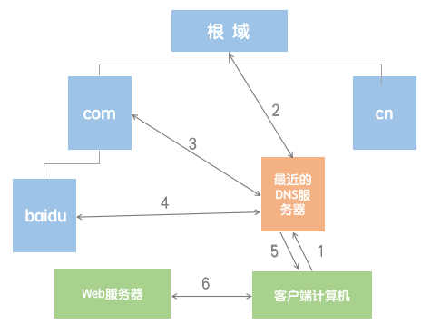

## TCP模块

知道IP地址以后，就可以委托操作系统内部的协议栈向这个目标IP地址发送消息了。客户端会创建套接字，然后将管道连接到服务器的套接字上，连接成功后，客户端就可以收发数据了。在Socket连接和发送过程中，TCP模块都会创建特定的TCP头部。

TCP头部包含发送方端口、接收方端口、序号、ACK号、窗口等字段，用来记录和交换控制信息。Socket连接的第一步就是在TCP模块处创建表示连接的控制信息的头部，通过TCP头部中的发送方端口号和接收方端口号就可以找到要连接的套接字。在数据发送过程中，通过TCP头部中的序号和ACK号可以确定接收方是否收到网络包。

### 1、连接操作

数据收发操作的第一步是创建套接字。一般来说，服务器一方应用程序在启动时会创建号套接字并进入等待连接的状态。客户端则一般是用户触发特定动作，需要访问服务器的时候创建套接字。在这个阶段，还没有开始传输网络包。创建套接字以后，客户端会向服务器发起连接操作。

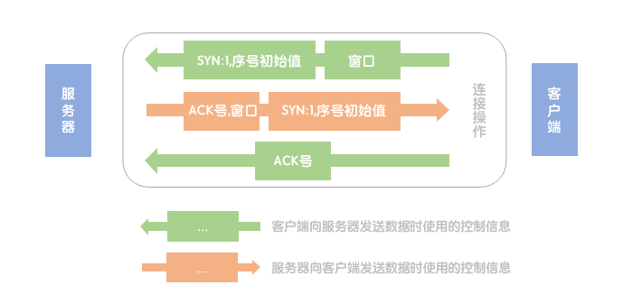

1、客户端会生成一个SYN为1的TCP包并发给服务器。这个TCP包的头部还包含了客户端向服务器发送数据时使用的序列号，以及服务器向客户端发送数据时需要用到的窗口大小。

在介绍下一步操作之前，我们先接受一下窗口。没发送一个包就等待一个ACK号的方式虽然简单，但比较浪费时间。TCP采用滑动窗口方式来管理数据发送和ACK号的操作。所谓滑动窗口，就是发送一个包后，不等待ACK号返回，而是直接发送后续一系列的包。使用滑动窗口方式可能会出现发送方发送的数据超出了接收方的处理能力，所以接收方需要告诉发送方自己最多能接受多少数据，然后发送方根据这个值对数据发送操作进行控制。

2、当包到达服务器之后，服务器会返回一个SYN为1的TCP包，这个包的头部也包含了序号和窗口大小，此外还包含表示确认已收到包的ACK号。

3、当服务器返回的包到达客户端时，客户端会向服务器返回一个包表示确认确认的ACK号的TCP包。

### 2、收发操作

连接操作完成以后，双方进入数据收发阶段。数据收发阶段操作根据应用程序的不同有一些差异，以Web为例：

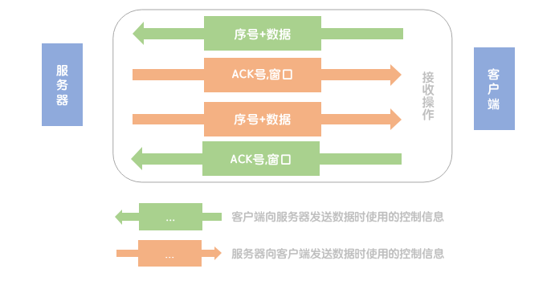

1、客户端会向服务器发送请求消息。TCP会将请求消息切分成一定大小的块，并在每块前面加上TCP头部，然后发送给服务器。TCP头部中包含序号，它表示当前发送的是第几个字节的数据。

2、当服务器收到数据时，会向客户端返回ACK号。在最初的阶段，服务器只是不断接受数据，随着数据收发的进行，数据不断传递给应用程序，接受缓冲区就会被逐渐释放。这是，服务器需要将新的窗口大小告知客户端。

3、当服务器收到客户端的请求消息后，会向客户端返回响应消息，这是过程和刚才的过程正好相反。

### 3、断开操作

服务器的响应消息发送完毕以后，数据接收操作就结束了，这时就会开始执行断开操作。以Web服务器为例：

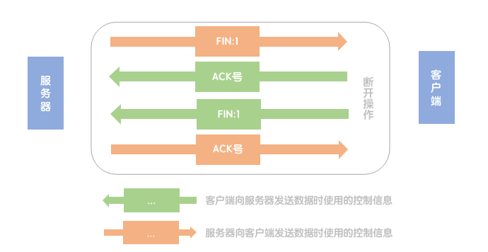

1、服务器先发送一个FIN为1的TCP包。

2、客户端返回一个表示确认收到的ACK号。

3、客户端向服务器发送一个FIN为1的TCP包。

4、服务器返回一个包换ACK号的TCP包。

最后，在等待一段时间后，套接字会被删除。

## IP模块

IP模块接收TCP模块的委托负责包的收发工作。IP模块负责添加MAC头部和IP头部，之后将生成的包存放在内存中。

IP头部有很多字段，如发送方IP地址、接收方IP地址、版本号、头部长度、总长度等等。我们重点讨论的是发送方IP地址和接收方IP地址。发送方IP地址是由TCP模块告知的，这个地址最初来源于应用程序。为了简化模型，假设发送方计算机只有一个网卡，那么接收方的IP地址就是该计算机的网卡对应的IP地址。

生成IP头部后，接下来IP模块还需要在IP头部之前加上MAC头部。MAC头部主要有三个字段，分别是接收方MAC地址、发送方MAC地址和以太类型。根据上面假设计算机只有一个网卡，那么很显然，发送方MAC地址填写的就是计算机的网卡对应的MAC地址。以太类型为IP协议的值0800。接收方MAC地址首先需要查询下一个转发路由器的IP地址，然后通过ARP查询目标路由器的MAC地址。其具体过程为：

查询下一个转发路由器的IP地址就是使用接收方IP地址与路由表中的记录进行匹配，找到匹配记录中的网关，该网关就是下一个路由器的IP地址。

在了解查询下一个转发路由器的IP地址过程之前，首先我们要了解路由表，路由表的大致结构如下：

|目标地址 Destination|子网掩码 Netmask|网关 GateWay|接口 Interface|跃点数 Metric|
|:----|:----|:----|:----|:----|
|0.0.0.0|0.0.0.0|10.10.1.1|10.10.1.16|25|
|192.168.1.0|255.255.255.0|10.10.1.2|10.10.1.16|2|

其匹配过程为：

1、根据子网掩码列中的值判断IP地址网络号的比特数，并匹配相应数量的比特。

2、如果有多条匹配记录，则寻找网络号最长的记录。

3、有时路由表会存在网络号长度相同的多条记录，则选择跃点数最小的记录。

4、如果路由表无法找到匹配记录，则使用子网掩码为0.0.0.0的记录。

ARP查询目标路由器的MAC地址过程为：ARP利用广播(将包发给连接在同一以太网中的所有设备)向所有设备提问: "xx这个IP是谁的？请把你的MAC地址告诉我。"然后就有人回答: "这个IP地址是我的，我的MAC地址是xxx。"

## 网卡

IP模块生成的包只是存放在内存中的一串数字信息，没有办法直接发送给对方。我们需要将数字信息转化成电或光信号，才能在网线上传输，负责执行这一操作的是网卡。

### 1、网卡的结构

网卡主要由缓冲区，MAC模块，PHY(物理层装置)、RJ-45接口和ROM组成，其中缓冲区用于临时保存收发的包的内存空间，MAC模块用来控制碰撞检测、重发等以太网收发操作的部分，PHY发送和接收信号的电路，RJ-45接口用来连接网线。ROM用来存放MAC地址。

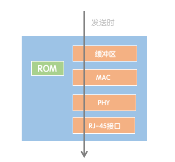

### 2、发送包

网卡驱动从IP模块获取包后，会将其复制到网卡内的缓冲区中，然后向MAC模块发送发送包的命令。MAC模块将包从缓冲区中取出，并在开头加上报头和起始帧分界符，在末尾加上用于检验错误的FCS(帧校检序列)。

1、报头是一串像101010...这样1和0交替出现的比特序列，长度为56比特，它的作用是确定包的读取时机和根据报头确定时钟信号的变化周期，然后从时钟信号中提取出数据信号。报头后面的起始帧分界符为10101011(最后两比特为11)，是用来表示包起始位置的标记。

2、FCS用来检查包传输过程中因噪声产生的错误，是一串32比特的序列。

加上报头、起始帧分界符和FCS后，PHY会将信号转换成网线上可以传输的格式，并通过网线发送出去。

>为什么信号的传输是将数据信号和时钟信号叠加？
>当数据信号连续出现0或1的时候，这是电流和电压没有发生变化，所以就无法知道从什么地方进行切分。最简单的的解决方案是在发送数据信号之外，在额外发送一组用来区分数据信号间隔的时钟信号。但这种方法存在问题。当距离较远，网线比较长时，两条线路长度会发生差异，数据信号和时钟信号的传输会产生时间差，始终就会偏移。要解决这个问题，就要采用数据信号和时钟信号叠加的方法。
# 客户端局域网

网络包转化成电信号从计算器流出之后，会通过交换机和路由器等设备前进。而网络包到达的第一站则是连接在网卡上的网线(双绞线)。之后流入交换机，交换机先接收信号并将其还原成数字信息，然后再重新转换成信号并发送出去。最后，网络包到达路由器，路由器再将网络包进行转发。交换机和路由器都是负责将包进行转发，但他们的工作方式有一些差异，交换机是基于以太网规格工作的设备，而路由器是基于IP工作的。

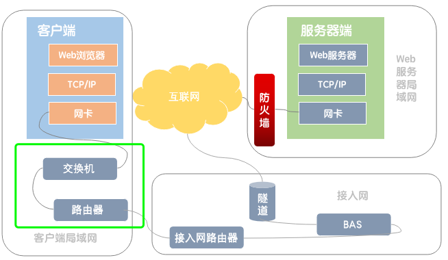

## 双绞线

### 1、双绞线的结构

双绞线有八条两两相互缠绕的线组成。使用交叉网线(网线的两头使用两种标准，比如一头使用T568A，一头使用T568B)，可以用于两台电脑传输数据。使用直连网线(网线两头使用相同标准)，连接网络设备。

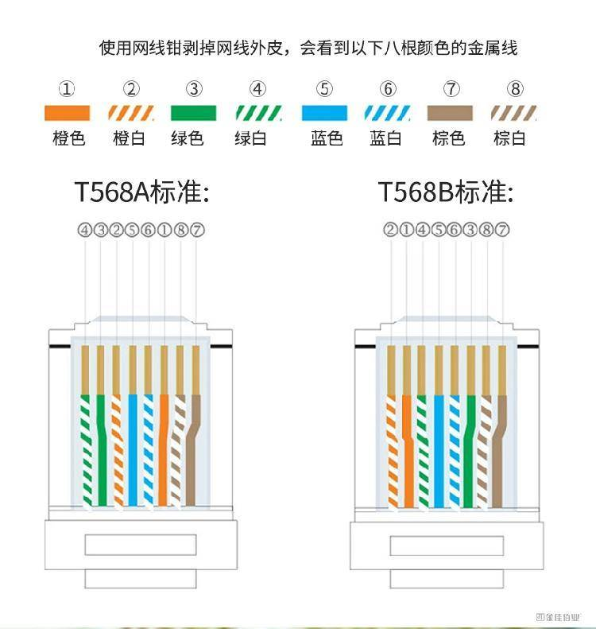

### 2、信号在双绞线上传输

网卡中的PHY模块负责将包转化成电信号，信号通过RJ-45接口进入双绞线，信号通过接口中的1号和2号针脚流入网线，然后信号会通过网线到达交换机。信号在网线上传输，能量会逐渐丢失。网线越长，信号衰减越严重。信号不仅会随网线的长度衰减，还会受到噪声的干扰。影响网线的噪声主要有两种，一种是来自网线之外的其他设备，一种是网线中相邻信号线泄漏出来的。双绞线主要通过两根信号线的缠绕抵消外部性噪声，通过改变间距抑制内源性噪声。

## 交换机

### 1、交换机的结构

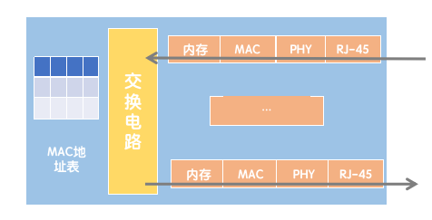

交换机的端口的结构和网卡结构类似，但交换机的端口不具有MAC地址，所以其工作方式也与网卡的工作方式有所不同。网卡通过核对收到包的接收方MAC地址判断是不是发给自己的，如果不是发给自己的则丢弃；相对的，交换机端口会直接接收所有的包，并放入缓冲区。

### 2、接收包

当信号从双绞线传入时，会进入PHY模块的接收部分，PHY模块会将网线中的信号转化为通用格式，然后传递给MAC模块，MAC模块将信号转化为数字信息，然后通过包末尾的FCS校验错误，如果没有问题则放在缓冲区中。

### 3、查询端口

交换机主要根据MAC地址表来查询发送端口，MAC地址表主要包含两个信息，一是这个设备的MAC地址，二是该设备连接在交换机哪个端口上。MAC地址表的大致结构如下：

|MAC地址|端口|控制信息|
|:----|:----|:----|
|00-60-97-A5-43-3C|2|...|

MAC地址表的维护方式为：

1、收到包时，将发送方的MAC地址以及输入端口的号码写入MAC地址表中。

2、为了防止终端设备移动产生的问题，只需要将一段时间(几分钟)不使用的过时记录从地址表中删除就可以了

将包存入缓冲区后，接下来需要查询这个包的接收方MAC地址是否已经在MAC地址表中有记录了，然后根据MAC地址查询到的端口号，就可以根据交换电路转发到相应的端口。如果交换机无法判断应该把包转发到哪个端口，就会把包转发到除源端口以外的全部端口。这样做不会产生什么问题，因为以太网的设计就是将包发送到整个网络，只有相应的接受者才会接受包，其他设备则会忽略这个包。

### 4、转发包

当网络包通过交换电路到达发送端口时，端口中的MAC模块和PHY模块会执行发送操作，将信号发送到网线中。

## 路由器

### 1、路由器的结构

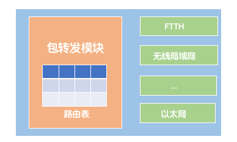

路由器包括转发模块和端口模块组成，路由器的端口模块包含多种类型的端口，例如FTTH端口、无线局域网端口、以太网端口等。其中转发模块负责根据路由表判断包的转发目的地，端口模块负责包的转发操作。

### 2、接收包

路由器在转发包时，首先会通过端口将发过来的包接收，这一步操作取决于端口对应的通信技术，对于以太网端口，就按照以太网的规范进行工作，而无线局域网的端口就按照无线局域网的规范工作。我们以以太网端口为例，端口接收包的方式与交换机接收包的方式相同，不过路由器接收包，验证FCS之后，会多一步判断端口的MAC地址与接收方MAC地址是否一致，一致时端口才接收这个包，否则就丢弃包。

### 3、查询端口

接下来，转发模块会根据接收到的包的IP头部记录的接收方的IP地址，在路由表中进行查询，以此判断转发目标。查询路由表的过程与IP模块查询路由表的过程相似，这里就不再赘述了。然后，转发模块将包转移到转发目标对应的端口，端口在按照对应的规则将包发送出去。

### 4、转发包

端口的发送操作与IP模块发送包的操作相同，首先是在包的头部加上MAC地址和IP地址，设置其中的一些字段，然后完成的包转化成电信号并发送出去。

>路由器与交换机的区别？
>计算机和路由器发送网络包时，都需要在开头加上MAC头部，准确的说，应该是将IP包装进以太网包的数据部分中，委托以太网去传输数据。IP协议本身没有传输数据的功能，因此包的传输要委托以太网进行。路由器是基于IP设计的，交换机是基于以太网设计的，因此IP与以太网的关系，就是路由器与交换机的关系(这里的路由器和交换机指的是实现IP与以太网机制的纯粹的路由器和交换机，并不适用于实际的路由器，因为实际的路由器内置交换机功能)。因此路由器与交换机的关系为路由器委托交换机将包传输到另一个路由器。
# 接入网

网络包首先会被转发到接入网路由器，接入网路由器会为网络包添加MAC头部、PPPoE头部和PPP头部，然后网络包会按照PPPoE规则进行转发到BAS。BAS收到用户路由器发送的网络包之后，会去掉MAC头部和PPPoE头部，然后用隧道机制将包发送给网络运营商的路由器。

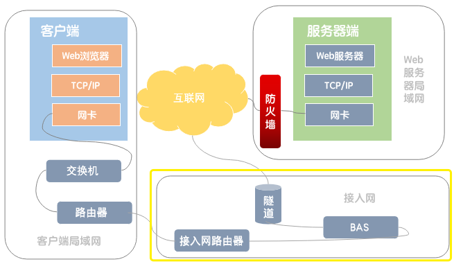

## 互联网接入路由器

网络包通过交换机和路由器一步步的接近它的目的地，在通过互联网接入路由器之后，进入互联网。路由器的转发操作都是相同的，因此互联网接入路由器和以太网路由器的转发操作几乎一样。不过互联网接入路由器发送网络包的操作和以太网路由器有一点不同，互联网接入路由器是按照接入网规则来转发包的。所谓接入网就是连接互联网与家庭、公司网络的通信线路。一般接入网方式包括FTTH(光纤接入网)、ADSL、电话线等等。

以FTTH接入方式为例，首先需要输入用户名和密码，登录之后为计算机分配公有地址才能访问互联网，FTTH是使用PPPoE的方式实现登录功能的，而PPPoE是由传统电话拨号上网上使用的PPP协议发展而来。所以我们首先要了解PPP的工作方式。

PPP的工作方式为：首先，用户向运营商的接入点拨打电话，电话接通后，输入用户名和密码进行登录操作。用户名和密码发送给认证服务器，认证服务器校验这些信息是否正确。确认无误后，认证服务器会返回IP地址等配置信息，并将这些信息发给用户。用户的计算机根据这些信息配置IP地址等参数，完成TCP/IP收发网络包的准备工作，接下来就可以发送TCP/IP包了。

不过，FTTH不能直接使用PPP，其原因为：传输PPP和将IP包装到以太网中传输一样需要报头和FCS等元素，但PPP借用HDLC协议作为容器，而HDLC是为专线中传输网络包设计的。为了取代这一机制，我们用以太网代替HDLC来装载PPP协议，又因为PPP设计上和以太网有所不同，所以设计了一个新的规格，就是PPPoE。

登录成功之后，互联网接入路由器会在IP头部加上MAC头部、PPPoE头部和PPP头部，然后按照以太网的规则转化为电信号发送出去。

## FTTH(光纤接入网)

### 1、光纤

光纤是由一种双层结构的纤维状透明材质(玻璃和塑料)构成的，通过在里面的纤芯中传导光信号来传输数字信息。

### 2、连接运营商的BAS

首先，用户端的光纤接收器将以太网的电信号转化为光信号。光信号通过连接到光纤收发器的光纤直接到达BAS前面的多路光纤接收器，然后多路光纤接收器将光信号转化为电信号，将信号发送到BAS。

## 运营商的BAS(宽带接收服务器)

互联网本来就是由很多路由器相互连接组成的，因此原则上应该是将接入网连接到路由器上。随着接入网的发展，接入网连接的路由器也跟着演化，这种进化型的路由器叫做BAS。

BAS除了拥有包转发功能以外，还有用户认证和配置下发的功能，在FTTH接入网中，都需要先输入用户名和密码，登录之后才能访问互联网，而BAS就是登录操作的窗口。

BAS接收到网络包后，BAS会将MAC头部和PPPoE头部去掉，取出PPP头部以及后面的部分，然后通过隧道机制将包发送出去。

## 隧道

所谓隧道，就类似于套接字之间建立的TCP连接，在TCP连接中，我们从一侧的出口放入数据，数据会原封不动的从另一个出口出来。隧道有几种实现方式，其中一种是基于TCP连接实现的。在这种方式中，首先需要在网络上的隧道路由器上建立TCP连接，然后将连接两端的套接字当做路由器的端口，并从这个端口发送数据。这样就形成了一条用户一直到运营商路由器的通道。

# 运营商(互联网)

互联网的实体并不是由一个组织运营管理的单一网络，而是由多个运营商网络相互组成的。

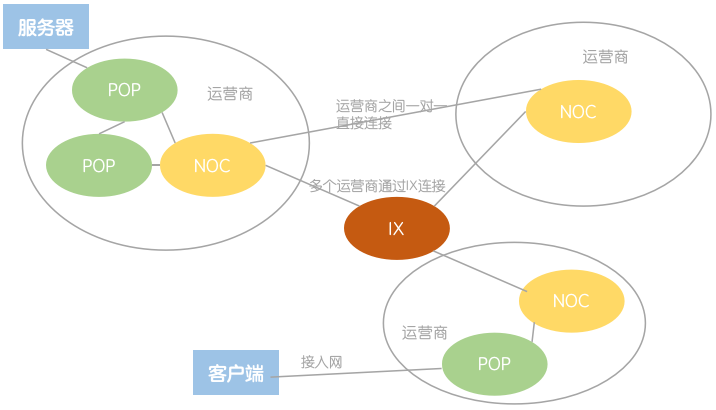

FTTH等接入网是与用户签约的网络运营商设备相连的，这些设备成为POP(接入点)。互联网的入口就位于这里。

NOC(网络运营中心)是运营商的核心设备，从POP传来的网络包都会集中到这里，并从这里转发到离目的地更近的POP，或转发到其他的网络运营商。

IX(互联网交换中心)的主要作用是通过设置一个中心设备，通过连接中心设备的方式减少线路数量。IX实际上是具有大量高速以太网端口的交换机。

# Web服务器端局域网

Web服务器会部署到公司或网络运营商等管理的数据中心中。现在最常见的方式是将Web服务器部署到数据中心中。数据中心是与运营商核心部分NOC直接相连或与运营商之间的IX直接相连，因此Web服务器可以获得很高的访问速度。如果Web服务器直接部署到数据中心里，那么网络包会从互联网核心部分直接进入数据中心，然后到达服务器。如果从互联网传来的网络包会无节制的进入服务器，那意味着服务器在攻击者看来处于“裸奔”状态。因此需要在服务器前面部署防火墙。

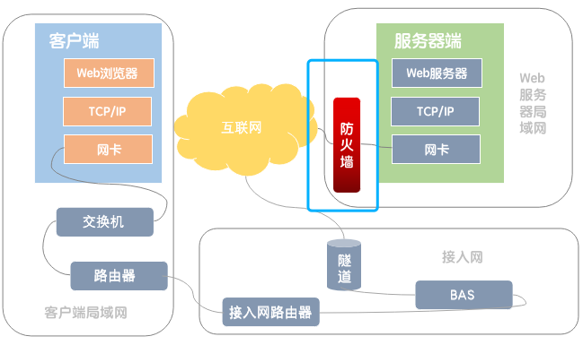

## 防火墙

防火墙的作用类似于网关，它只允许发往指定服务器的指点应用程序的网络包通过，从而屏蔽其他不允许通过的包。包过滤方式的防火墙可根据接收方IP、发送方IP、接收方端口号、发送方端口号、控制位等信息来判断是否允许某个包通过。

这里通过实现互联网可以访问到Web服务器，但禁止Web服务器访问互联网的功能，来了解防火墙的具体工作方式。在设置包过滤规则时，首先观察包是如何流动的。通过接收方IP地址和发送方IP地址，我们就可以判断包的起点和终点，从互联网发过来的包起点是不确定的，但是终点是确定的，即Web服务器，因此我们只需要设置终点为Web服务器的IP地址的包通过，就可以实现从互联网发过来的包通过防火墙，但这样还是不够的，我们需要限定网络包可以访问的应用程序，所以我们需要设置特定端口号可以通过防火墙。这样我们就实现了互联网可以访问Web服务器，但我们还没有禁止服务器访问互联网。如果将Web服务器发往互联网的包全部阻止，那么肯定会影响从互联网访问Web服务器的操作。只要我们阻止TCP控制位中SYN为1，ACK为0的包就可以实现阻止服务器访问互联网，因为TCP控制位中SYN为1，ACK为0是发起TCP连接的第一包。

# 服务器端

网络包通过防火墙后，通过路由器的层层转发，最终网络包会到达Web服务器。Web服务器收到包后，网卡和网卡驱动会接收这个包并转交给协议栈。协议栈依次检查IP头部和TCP头部，如果没有问题则取出HTTP消息数据并进行组装。HTTP消息被恢复成原来的形态，然后通过Socket库转交给Web服务器。Web服务器分析HTTP消息的内容，并根据请求内容将读取的数据返回给客户端。

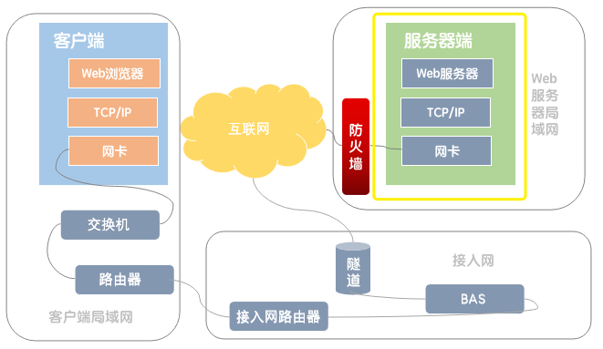

## 网卡

到达服务器的包本质上是电信号或光信号，网卡接收到信号，将其还原成数字信号。局域网中传输的网络包是由数字信息和用来同步的时钟信号叠加而成的，从中分离出时钟信号，然后根据时钟信号同步，就可以得到数字信息了。然后根据包末尾的FCS校验错误，如果包没有发生错误，就检查MAC头部中的MAC地址，如果包是自己的，就将网络包放进网卡的缓冲区，否则丢弃这个包。

## IP模块

网卡驱动从网卡的缓冲区取出包，将包转发给IP模块。IP模块首先会检查IP头部的格式是否符合规范，然后检查接收方IP地址，看包是不是自己的。接下来会检查IP头部的协议号字段，将包转发给相应的模块，例如协议号为06，则包转发给TCP模块。

## TCP模块

### 1、收到发起连接的包

当TCP头部控制SYN为1时，表示这是一个发起连接的包，TCP模块会：(1) 确认TCP头部的控制位SYN；(2) 检查接收方端口号；(3) 为相应的等待连接套接字复制一个新的副本；(4) 记录发送方IP地址和端口号等信息。

### 2、收到数据包

(1) 根据收到的包的发送方IP地址、发送方端口号、接收方IP地址、接收方端口号找到相对应的套接字；(2) 将数据块拼合起来保存到接收缓冲区中；(3) 向客户端返回ACK。

## Web服务器

服务器会根据请求消息中的方法和URI返回数据。(1)如果URI指定的文件内容为HTML文档或图片，那么只要直接将文件内容作为相应消息返回客户端就可以了;(2)如果URI是一个程序文件，Web服务器会委托操作系统运行这个程序，然后从请求消息中取出数据（如果方法为GET，则将URI后面的参数传递给程序；如果方法为POST，则将消息体中的数据传递给程序）并交给运行程序。接下来，运行的程序收到数据会进行一系列处理，并将输出数据返回给Web服务器。当服务器完成对请求消息的各种处理之后，就可以返回响应消息了。这里的工作过程和客户端向服务器发送请求消息时的过程相同。

# 总结

最后，通过一张流程图对浏览器输入网址到显示出网页内容的全部过程进行总结。从浏览器输入网址到页面显示内容，在这短短几秒背后，离不开各种设备和软件的相互配合。本文虽然没有对所有的过程进行详尽的一一讲解，但大家可以通过本文了解整个网络的全貌和了解网络的基本设计思路。

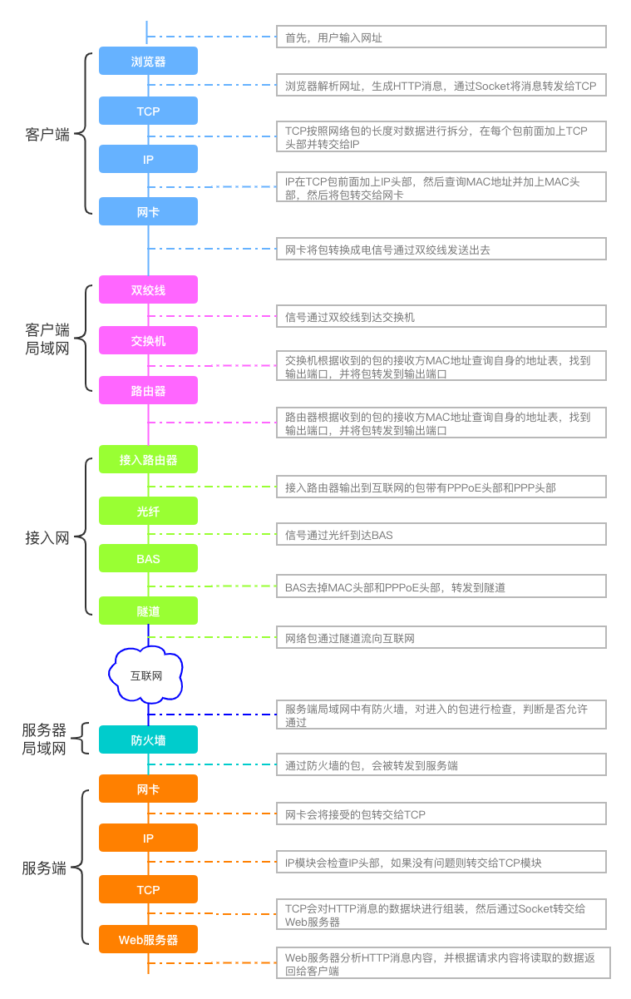

# 补充

## 路由器的地址转换

随着互联网的普及，空闲IP地址越来越少，如果为每台网络设备都分配唯一的IP地址，那么可分配的IP地址将会被用光。为了解决地址不足的问题，我们可以利用公司内部设备的地址不一定要和其他公司不重复的性质，为公司内部设备分配不固定的地址，从而节省IP地址。我们将10.0.0.0~10.255.255.255、172.16.0.0~172.31.255.255和192.168.0.0~192.168.255.255这三段地址设为私有地址，用于公司内网。将其他的IP地址设为公有地址。

当公司内网和互联网连接的时候，公司内网分成两个部分，一部分是对互联网开放的服务器，另一部分是公司的内部设备。其中对互联网开放的部分分配公有地址，可以和互联网直接进行通信。相对地，内部设备则分配私有地址，不能和互联网直接通信，而是通过一种特别的机制进行连接，这种机制就叫地址转换。

### 地址转换的基本原理

地址转换的基本原理是在转发转发网络包时对IP头部中的IP地址和端口号进行改写。其具体过程为：

1、TCP连接操作的第一个包被转发到互联网时，将发送方IP地址从私有地址改写成公有地址，同时地址转换设备会随机分配一个空闲的端口号改写发送方端口号。

2、改写前的私有地址和端口号，以及改写后的公有地址和端口号，会作为一组相对应的记录保存在地址转换设备内部的一张表中。

3、改写发送方IP地址和端口号之后，包就被发送到互联网，最终到达服务器，然后服务器会返回一个包。服务器返回的包接收方是改写后的公有地址和端口号。

4、接下来地址转到设备会从地址表中通过公有地址和端口号找到对应的私有地址和端口号，并改写接收方信息，然后将包发给公司内网，这样包就能到达原始的发送方了。

### 从互联网访问公司内网

由于从互联网访问公司内网的包，如果对应表中没有记录就无法正常转发。意味着对于没有访问互联网的内部设备，因为没有公有地址与私有地址的对应关系，所以互联网是不能向其发送网络包的。只要我们将内部设备的私有地址手动添加到地址转换设备中，互联网就可以访问这台内部设备了。

